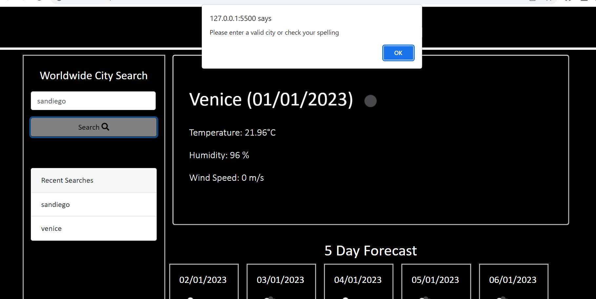

# Meteorological-Dashboard

Mateorological Dashboard displays weather data for a city searched by the user. It uses [5 Day OPen Weather API](https://openweathermap.org/forecast5). Open Weather API ia a Server API that allows a developer to access their data and functionality by making requests with specific parameters to a URL. Our aim is to build a weather dashboard that will run in the browser and feature dynamically updated HTML and CSS hence as a traveler I can search weather for multiple cities and plan a trip accordingly.

# Description

These are the criteria given to us:

* Use the [5 Day Weather Forecast](https://openweathermap.org/forecast5) to retrieve weather data for cities.

* Create a weather dashboard with form inputs.
  * When a user searches for a city they are presented with current and future conditions for that city and that city is added to the search history
  * When a user views the current weather conditions for that city they are presented with:
    * The city name
    * The date
    * An icon representation of weather conditions
    * The temperature
    * The humidity
    * The wind speed
  * When a user view future weather conditions for that city they are presented with a 5-day forecast that displays:
    * The date
    * An icon representation of weather conditions
    * The temperature
    * The humidity
  * When a user click on a city in the search history they are again presented with current and future conditions for that city

  The following image shows the web application's appearance and functionality:

  

# Getting Started

Step 1

I registered for an API key in order to use this API. After registering for a new API key, you may need to wait up to 2 hours for that API key to activate.

Step 2

I created a new repository on my GitHub account and clone it to my computer using git clone command.

Then I deployed it by using the git add, git commit, and git push commands to save and push my code to my GitHub repository.

I Navigated to my GitHub repository in the browser and then select the Settings tab on the right side of the page.

On the Settings page, scrolled down to the GitHub Pages section. Then, in the section labeled Source, select the main branch as my source.

This led to my webpage viral https://najma53.github.io/Meteorological-Dashboard-

Step 3

I started with index.html file first. Bootstrap link were commented out, hence activated them and link my script.js file and style.css file. Then based on bootstrap card method (total colums to be 12), 3 colums were give to aside section on left side and then 9 columns were given to current weather data and 5 day data. Once this was done, style.css was touched on a bit to seperate the section. At this point, this is what the project looked [like](./assets/step3.png)

Step 4

Next worked on script.js file, trying to write code as well as breaking it to meet acceptance criteria and hoping console shows no error. This was tricky, tried  many easy options like 16 day API, one call API but the key was not working. Only on 5 Day Api , the key was working  and the data returned by Ajax was not simple, especially the date and the icon. More explaination about each step is explained in script.js file.

Step 5

I went back to style.css file and index.html file to give a few final touches to it. I added a footer to index. html file and used style.css file to change the full look of the page. This is what my final application looks like.

This is when a wrong city name is typed or a city is not existing. An alert pops up.

This is when everything is correctly typed and city exists.

.png)

# Conclusion

I learnt a lot from this project, took me a while to understand it, a lot of google foo and a bit of you tube watching videos but in the end everything came together. Not sure what I have done is correct but loved breaking the code and rebuilding it. Was frustrating but enjoyable when you learn something new.